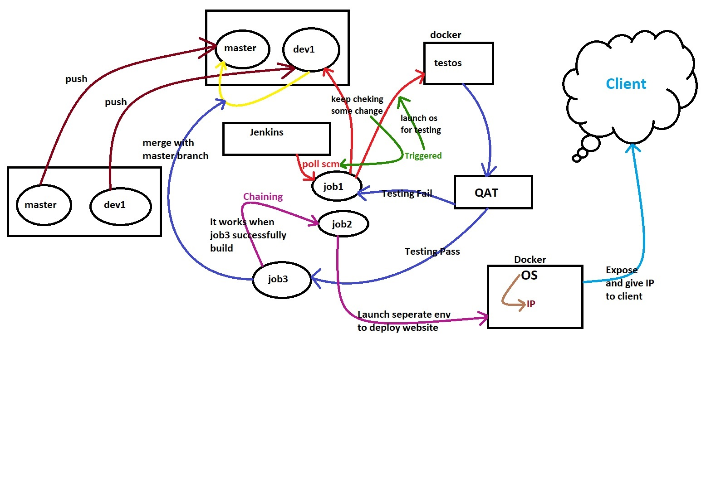
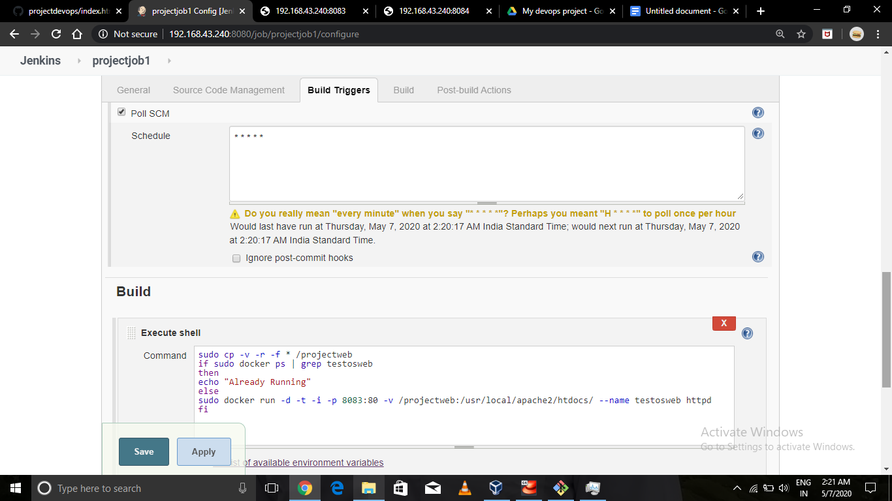
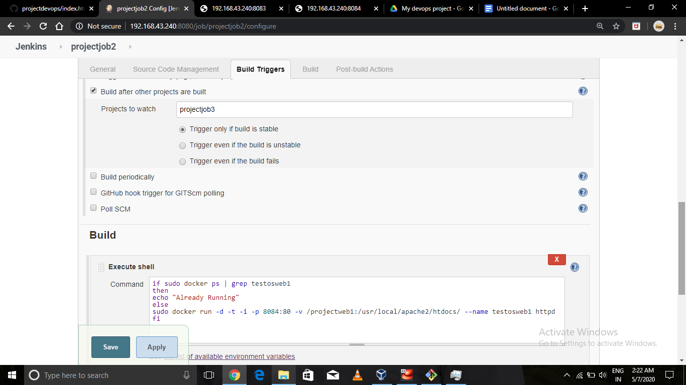
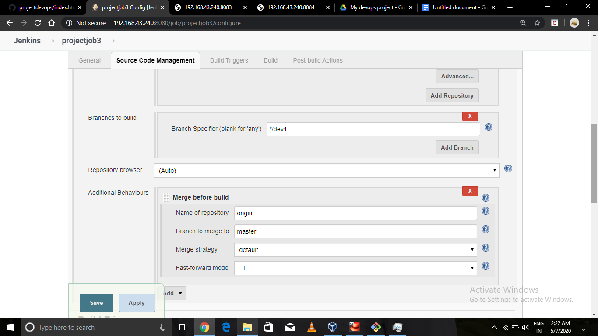
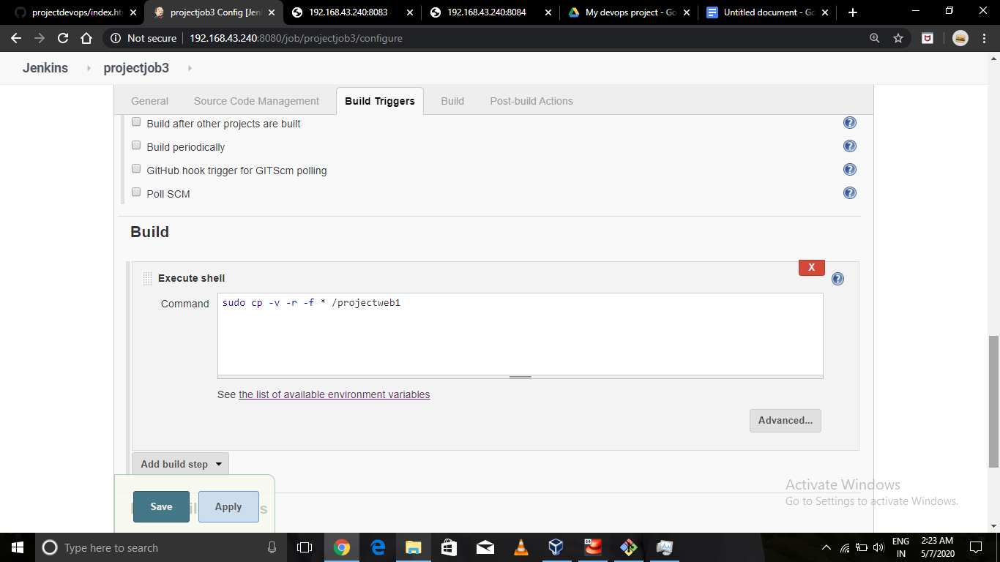
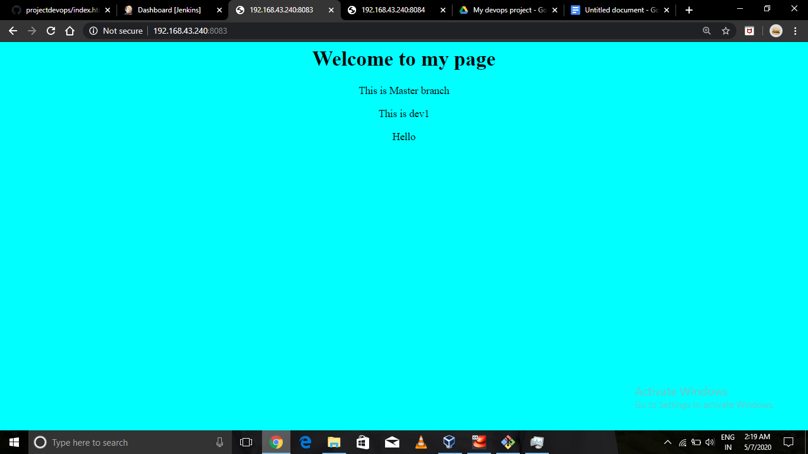
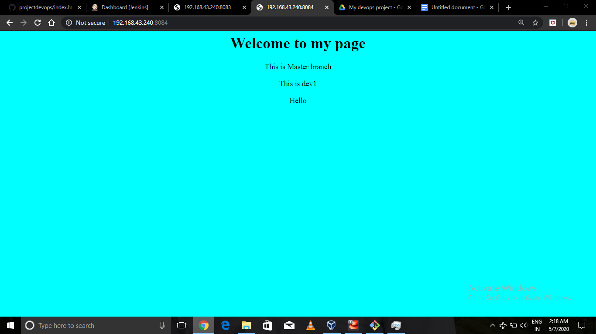
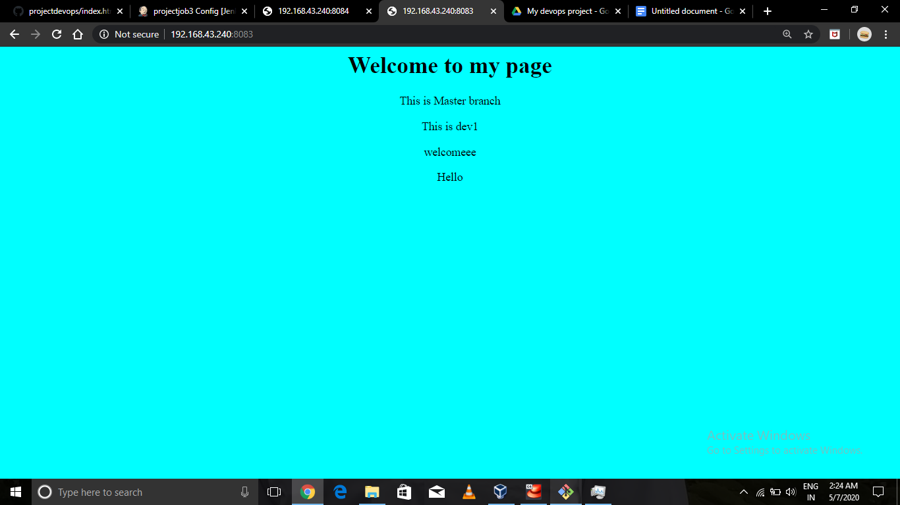
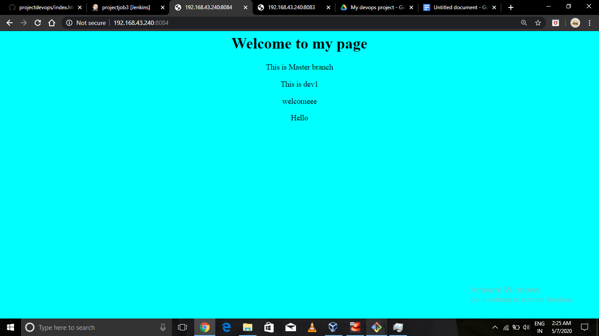

# projectdevops
> Developed By
>
>
> ***Gaurav Kumar Patel***
>
>
> (Under the mentorship of ***Mr. Vimal Daga, LinuxWorld*** )

<br/>

***Automate Deployment on Server and With Jenkins Containerized Docker Integration On Linux System and Provisioned by DevOps***

  I have developed my website on **DOCKER** and achieved end to end Automation.
<br/>

## OverView


# Steps Of Deployment
## Git Repo
* Create Github repo name ***projectdevops***
* Clone this repo using ``` git clone ```
* Create one more Branch ``` git branch dev1 ```

## Jenkins Job Creation
* Create 3 jobs of jenkins as 
  * projectjob1 -- job1
  * projectjob2 -- job2
  * projectjob3 -- job3
* ***job1*** connected to git branch ***dev1*** . In this we set triggers as **Poll SCM***. In execute shell we give command to     run docker and create a server with port ***8083***

  


* ***job2*** runs when ***job3*** bhuils successfully . In this we set triggers as ***build after job1 projects are build***. In execute shell we give command to run docker and create a server with port ***8084***

  


* ***job3*** runs when testing team confirms after running ***job1*** . After Confirming it merges with ***master*** branch.

   
  
    * After merging it coppy the code into webserver.
  
      
  
  
    * After build ***job3*** successfully ***Job2*** start running and Finally Website Deploy on the Docker. 
  
  
## Run The Job
  * we deploy ***job1*** in the Testing Environment Show the Webpage which is running on ***Port 8083***
  
    
  
  * After Confirming The testing Team we Build ***job3***. Then It Automatically merge with master Branch. After merging ***job2***        start running and deploy the Final Server. Give Ip To ***Client***
  
    
  
 ## After adding Something
  
  * Now ***Dev1*** add some lines And ***Commit***. After Commiting it Auto push the code into github As we set hooks for push.             ***job1*** Keep checking into github if find some changes Happens by Dev1 so ***job1*** start running and Deploy into testing           Environment. 
    
    
    
  * After Confirming The testing Team we Build ***job3***. Then It Automatically merge with master Branch. After merging ***job2***        start running and deploy the Final Server. Give Ip To ***Client***
  
    
